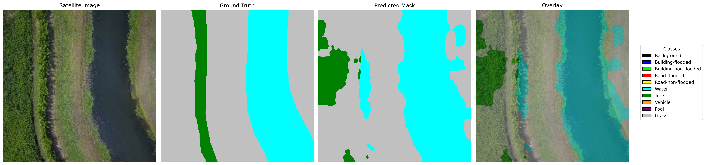
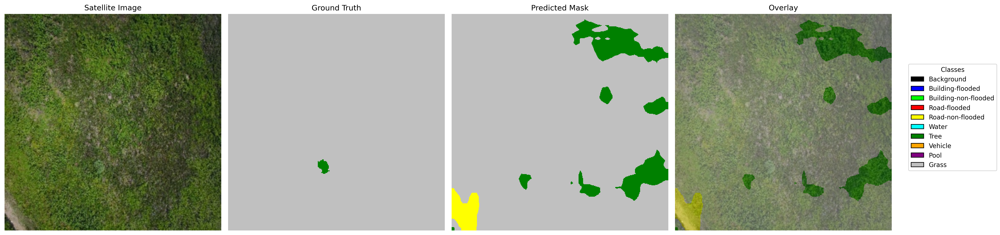
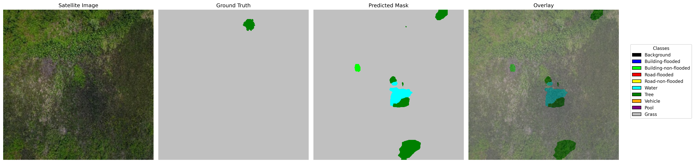
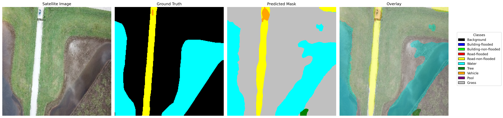

## FloodNet Semantic Segmentation (DeepLabV3‑ResNet101)


End-to-end semantic segmentation of flood-related classes on the FloodNet-Supervised_v1.0 dataset using PyTorch and Torchvision. The final validated model is a DeepLabV3‑ResNet101 with a custom Focal+Dice loss and corrected class weighting for severe class imbalance.

### Project status
- Training, evaluation, inference, and qualitative visualization are complete and reproducible
- Large artifacts (datasets, model weights, predictions) are ignored via `.gitignore`

## Environment setup
- Create a virtual environment (Windows PowerShell):
```powershell
python -m venv venv
./venv/Scripts/Activate.ps1
pip install -r requirements.txt
```

## Requirements
Core libraries used (see `requirements.txt` for exact pins):
- torch >= 2.0.0
- torchvision >= 0.15.0
- opencv-python >= 4.5.0
- numpy >= 1.21.0
- albumentations >= 1.3.0
- tqdm >= 4.64.0
- matplotlib >= 3.5.0
- Pillow >= 8.3.0

## Dataset
This project targets the 10-class FloodNet-Supervised_v1.0 dataset.
- Expected on-disk layout after organization:
```
C:/flood_segmentation/
  data/
    images/
      train/ *.jpg|*.png
      val/   *.jpg|*.png
      test/  *.jpg|*.png
    masks/
      train/ *.png (indexed labels)
      val/   *.png (indexed labels)
      test/  *.png (indexed labels)
```

Two helper scripts are provided:
- `organize_dataset.py`: copies from `FloodNet-Supervised_v1.0/` into `data/images|masks/{train,val,test}`
  - Place the extracted FloodNet dataset folder at `C:/flood_segmentation/FloodNet-Supervised_v1.0/`
  - Run:
```powershell
python organize_dataset.py
```
- `resize_floodnet.py`: alternative pipeline if you have `raw/{train,val,test}/{images,masks}` and want to resize into `data/`
  - Adjust `IMG_SIZE` and `SRC_ROOT` as needed

Notes:
- Dataset and the `FloodNet-Supervised_v1.0/` folder are `.gitignore`d.
- Masks should be single-channel with integer class IDs.

## Training
- Main script: `train.py`
- Key details:
  - Auto-detects number of classes from masks under `data/masks/{train,val,test}`
  - Uses DeepLabV3‑ResNet101 with both `classifier` and `aux_classifier` replaced for 10 classes
  - Mixed precision (torch.amp), gradient accumulation, AdamW, ReduceLROnPlateau
  - Backbone frozen for epoch 0, unfrozen from epoch 1 with LR halved
  - Robust class weights from pixel frequencies; absent classes weighted 0 to avoid instability
  - Checkpoints: `checkpoint.pth` (rolling), `best_model.pth` (best mIoU)

Run:
```powershell
python train.py
```
Configuration touchpoints:
- Image size and augmentations: `datasetLoader.py` (`IMG_SIZE`, `get_train_transform`)
- Data roots: `train.py` uses `data/images/*` and `data/masks/*`

## Evaluation
- Script: `evaluate.py`
- Loads `best_model.pth` (make sure it exists from training)
```powershell
python evaluate.py
```
Outputs per-split and per-class IoU and overall mIoU.

## Inference
- Simple script: `inference.py`
  - Edit `MODEL_PATH` (defaults to `best_model.pth`) and set an input image path
  - Saves a colorized mask and a side-by-side comparison image
```powershell
python inference.py
```
- Robust script with extra checks: `inference_robust.py`
```powershell
python inference_robust.py
```

## Visualization against ground truth
- Script: `visualize_prediction.py`
  - Set `IMG_PATH` and `MASK_PATH`
```powershell
python visualize_prediction.py
```

## Classes
Class list used for evaluation/visualization (training auto-detects from masks):
0: Background, 1: Building-flooded, 2: Building-non-flooded, 3: Road-flooded,
4: Road-non-flooded, 5: Water, 6: Tree, 7: Vehicle, 8: Pool, 9: Grass.

## Files of interest
- `datasetLoader.py`: Albumentations pipelines, dataset, sampler
- `train.py`: training loop, hybrid losses (Focal + Dice), checkpoints
- `evaluate.py`: split-wise metrics calculation and reporting
- `inference.py`, `inference_robust.py`: single-image inference utilities
- `visualize_prediction.py`: GT vs prediction vs overlay and PNG export to `output/`
- `organize_dataset.py`, `resize_floodnet.py`: dataset preparation helpers

## Notes on artifacts
- `.gitignore` excludes `data/`, `best_model.pth`, `checkpoint.pth`, `output/`, and other large/log files
- To share large weights publicly, consider Git LFS (not enabled here)
 - Trained model weights (`best_model.pth`) are not included due to size. To generate weights locally, run the training script:
```powershell
python train.py
```
This will produce `best_model.pth` when a new best validation mIoU is achieved.

## Development journey (concise)
- Baseline (DeepLabV3‑ResNet50): Uncovered and fixed three major issues:
  - Metric bug inflating mIoU when classes were absent in an image
  - Partially loaded weights in evaluation, leaving the classifier head untrained
  - Class 0 (Background) scarcity causing unstable loss; fixed via robust class weights
  Result: reliable mIoU plateaued around ~0.28.
- Upgrade (DeepLabV3‑ResNet101): Ensured both the main `classifier` and `aux_classifier` were adapted to 10 classes to avoid conflicting gradients. This surpassed the ResNet50 ceiling quickly and became the final model.

## Final results
Validated on Train/Val/Test with identical evaluation logic (mIoU):
- Train: 0.3094
- Val:   0.3090
- Test:  0.3000

These closely aligned scores indicate good generalization without overfitting. Compared to the FloodNet paper’s DeepLabV3‑ResNet101 benchmark (0.487 mIoU), this is a strong baseline given the severe rarity of some classes (e.g., Background, Vehicle, Pool).

### Qualitative results
Below are sample visualizations generated by `visualize_prediction.py` (saved under `output/`).






## Learnings
- Trustworthy metrics matter: handle absent classes and NaNs explicitly
- Always ensure evaluation architectures and heads exactly match training
- Severe class imbalance requires careful class weighting and robust losses
- Auxiliary heads in pretrained models must be adapted or disabled to avoid conflicts

## Roadmap
- I will continue updating the codebase to push toward state-of-the-art quality
- Add configurable CLI, CSV export of metrics, deterministic seeds, experiment logging
- Improve inference batching/tiling and class name/color harmonization across scripts
 - Investigate improving rare-class performance to push mIoU > 0.30 baseline:
   - Targeted data augmentation for rare classes; class-aware/instance-balanced sampling
   - Oversampling/hard example mining; loss rebalancing (focal/tversky tuning)
   - Synthetic data generation and semi-supervised pseudo-labeling for scarce categories
   - Post-processing (e.g., CRF/graph refinements) and architectural upgrades
